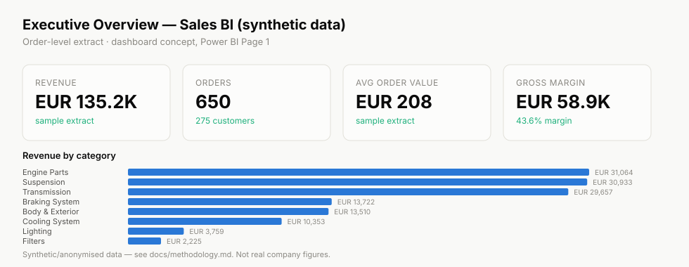
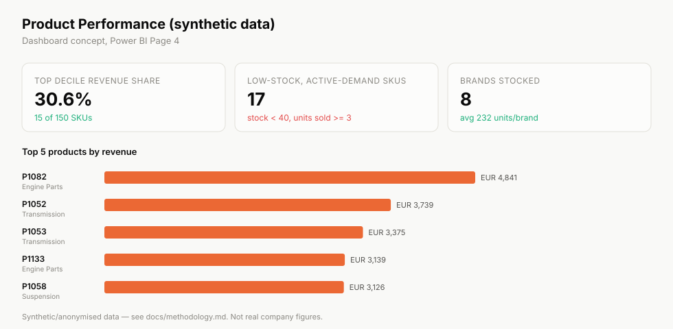

# Sales BI — Power BI Data Model & KPIs

A commercial BI project built the way a real Power BI report is built: a
star schema first, then DAX measures on top of it, then pages. Focused on
executive and product-performance reporting for a synthetic e-commerce
business.

> This project uses synthetic/anonymised data inspired by real-world sales
> and distribution BI scenarios. No confidential company data is included.

## Business Problem

Commercial teams need one number for "how are we doing" (executive) and a
different, more granular view for "what do we do about it" (product,
category, supplier). Most BI failures come from building these on
inconsistent logic — this project fixes that by defining every KPI once,
against a proper data model, before a single dashboard page gets built.

## Objectives

- Build a star schema (fact + dimensions) that supports both executive and
  product-level reporting from the same source.
- Define every KPI once, with SQL and DAX versions that agree.
- Identify commercial risk (stock coverage) and opportunity (revenue
  concentration) directly from the model.

## Dataset

| Table | Rows | Grain |
|---|---|---|
| `data/products.csv` | 150 | 1 row per SKU |
| `data/orders.csv` | 650 | 1 row per order (representative sample) |

## Methodology

1. Design the star schema ([`sql/data_model.sql`](sql/data_model.sql), diagram in
   [docs/data_model.md](docs/data_model.md)).
2. Define KPIs once, in SQL and DAX ([docs/kpi_dictionary.md](docs/kpi_dictionary.md)).
3. Run the executive and product-performance queries
   ([`sql/kpi_queries.sql`](sql/kpi_queries.sql)).
4. Build the dashboard pages from those exact numbers.

## Data Architecture

```text
   dim_customer      dim_product      dim_date
        │                 │               │
        └────────┬────────┴───────┬───────┘
                  ▼                ▼
                    fact_orders
                          │
                          ▼
              KPI measures (SQL / DAX)
                          │
                          ▼
        Executive Overview + Product Performance pages
```

Full model diagram: [docs/data_model.md](docs/data_model.md).

## Tools

Power BI, SQL, Excel, SAP ERP/S4HANA/BW4HANA (professional experience — see
[profile](https://github.com/felix4000)).

## Analysis

| Area | File |
|---|---|
| Star schema | [`sql/data_model.sql`](sql/data_model.sql) |
| KPI queries | [`sql/kpi_queries.sql`](sql/kpi_queries.sql) |
| KPI dictionary (SQL + DAX) | [`docs/kpi_dictionary.md`](docs/kpi_dictionary.md) |

Example — category performance, the query behind the "Revenue by category"
chart:

```sql
SELECT
    p.category,
    COUNT(DISTINCT o.order_id)                          AS orders,
    ROUND(SUM(o.revenue), 2)                            AS revenue,
    ROUND(SUM(o.revenue) - SUM(o.quantity * p.cost), 2) AS margin,
    ROUND(100.0 * (SUM(o.revenue) - SUM(o.quantity * p.cost)) / SUM(o.revenue), 1) AS margin_pct
FROM orders o
JOIN products p ON p.product_id = o.product_id
GROUP BY p.category
ORDER BY revenue DESC;
```

## Key Findings

1. **Engine Parts, Suspension and Transmission are the three largest
   categories by revenue** (EUR 31.1K, 30.9K, 29.7K respectively in the
   sample), together well over half of total revenue.
2. **Margin is consistent across categories (43-45%)** — this is a pricing
   structure story, not a category-mix story; margin improvement has to come
   from cost or price, not from shifting the sales mix.
3. **17 SKUs are simultaneously low-stock and actively selling** (stock < 40,
   3+ units sold in the period) — a concrete, actionable reorder list rather
   than a general "watch inventory" statement.
4. **The top 10% of SKUs generate 30.6% of revenue** — the same concentration
   finding as the flagship project, confirming it's not an artifact of one
   analysis.

## Recommendations

| Finding | Recommendation |
|---|---|
| 3 categories drive most revenue | Prioritise supplier negotiation and SEO/content investment on these 3 first |
| Margin is flat across categories | Look at cost and pricing, not category mix, for margin improvement |
| 17 SKUs at stock risk | Route this exact list to purchasing as a standing weekly report |
| Revenue concentrated in top decile | Track top-20-by-revenue as its own watchlist, reviewed monthly |

## Dashboard

**Executive Overview**



**Product Performance**



Built as SVG (from the real query results above) rather than `.pbix`
screenshots, so the concept is inspectable directly on GitHub. The `.pbix`
file itself isn't included — see [Limitations](#limitations).

## Project Structure

```text
sales-bi-powerbi/
├── README.md
├── data/
│   ├── products.csv
│   └── orders.csv
├── sql/
│   ├── data_model.sql
│   └── kpi_queries.sql
├── dashboard/
│   ├── executive_overview.svg
│   └── product_performance.svg
└── docs/
    ├── data_model.md
    └── kpi_dictionary.md
```

## How to Run

```bash
# Build the star schema and run the KPI queries against SQLite
sqlite3 sales_bi.db <<'EOF'
.mode csv
.import data/orders.csv orders
.import data/products.csv products
EOF
sqlite3 sales_bi.db < sql/kpi_queries.sql

# Or load data/*.csv directly into Power BI / Power Query and rebuild
# the star schema per docs/data_model.md, then apply the DAX measures
# from docs/kpi_dictionary.md.
```

## Limitations

- No `.pbix` file is published here: a `.pbix` isn't practically reviewable
  by a recruiter without Power BI Desktop installed, so the model, KPI
  definitions and dashboard concept are documented directly in SQL, Markdown
  and SVG instead — everything needed to rebuild it in Power BI in minutes.
- Synthetic order-level sample, not a full year of transactions — see
  [`ecommerce-performance-analytics`](https://github.com/felix4000/ecommerce-performance-analytics)
  for the full-funnel version of this same underlying data.

## About the Author

**Felix Ibeh** — Data Analyst, BI across e-commerce and distribution.
Power BI, SQL, SAP ERP/S4HANA/BW4HANA at Groupe Cipanguo and Euro4x4parts.

[LinkedIn](https://www.linkedin.com/in/felix-ibeh-data-analyst/) ·
[CV](https://felix4000.github.io/felix-ibeh-cv/) ·
[GitHub](https://github.com/felix4000)
# sales-bi-powerbi
Power BI star schema, SQL KPI definitions and executive/product dashboards (synthetic data)
